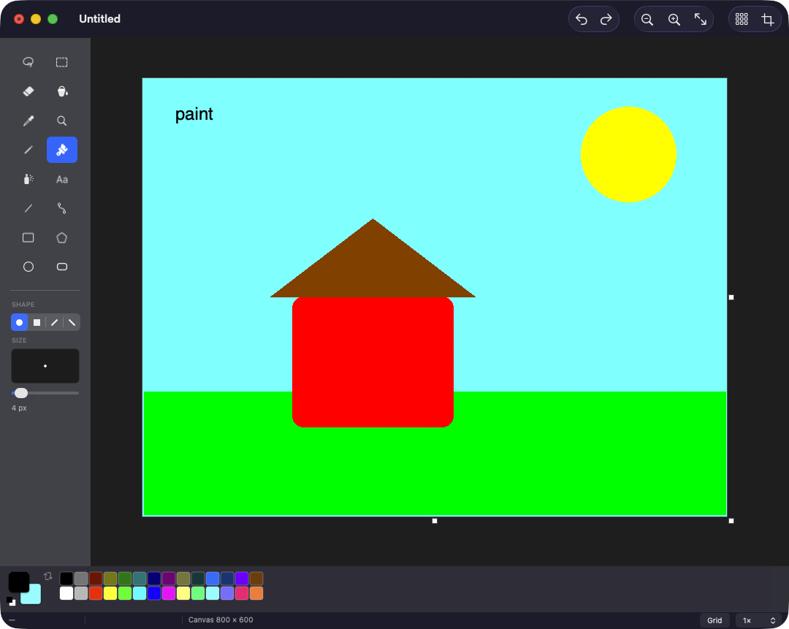
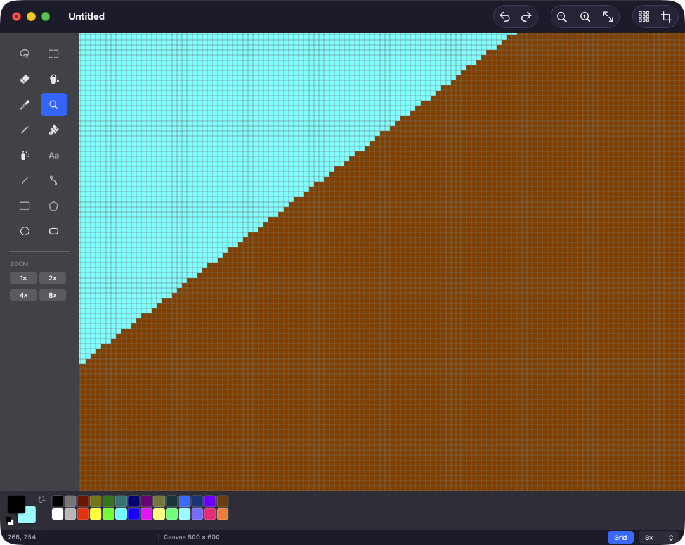

<h1 align="center">Paint</h1>

<p align="center">
  A pixel-perfect tribute to MS Paint, built natively for macOS in Swift and AppKit.
</p>

<p align="center">
  <a href="https://github.com/ilmakio/paint-macos/actions/workflows/ci.yml"></a>
  
  
  <a href="LICENSE"></a>
</p>

<p align="center">
  
</p>

macOS never got a Paint. Preview can crop, Pixelmator is a career, and every
"simple" web canvas smooths your pixels into mush. This is the missing one:
all sixteen tools from the original toolbox, the 28-colour palette, two active
colours on the left and right mouse buttons, and a bucket that respects a
one-pixel outline. No interpolation, no smoothing — the pixel you click is the
pixel that changes.

## Install

Download the latest `Paint.zip` from [Releases](https://github.com/ilmakio/paint-macos/releases),
unzip it, and drag `Paint.app` into `/Applications`.

The build is not notarised, so the first launch needs one extra step:
**right-click the app → Open → Open**. Alternatively, clear the quarantine flag:

```bash
xattr -dr com.apple.quarantine /Applications/Paint.app
```

### Building from source

Requires macOS 14 or later, Xcode 15+, and [xcodegen](https://github.com/yonaskolb/XcodeGen)
(`brew install xcodegen`).

```bash
git clone https://github.com/ilmakio/paint-macos.git
cd paint-macos
xcodegen generate
open Paint.xcodeproj
```

The `.xcodeproj` is generated from `project.yml` — edit the YAML and re-run
`xcodegen generate`, don't edit the project file by hand.

## The toolbox

| | | | |
|---|---|---|---|
| Free-Form Select `S` | Select `M` | Eraser `E` | Fill With Color `F` |
| Pick Color `I` | Magnifier `Z` | Pencil `P` | Brush `B` |
| Airbrush `A` | Text `T` | Line `L` | Curve `C` |
| Rectangle `R` | Polygon `G` | Ellipse `O` | Rounded Rectangle `U` |

- **Pencil, Brush, Eraser** take a size from the sidebar; the brush also picks
  between round, square and the two calligraphic slashes. `[` and `]` resize the
  nib without leaving the canvas.
- **Fill With Color** is 4-connected with an optional tolerance. At tolerance 0
  it behaves exactly like the original, diagonal leaks and all.
- **Eraser** lays down the background colour. Right-drag turns it into the
  colour eraser, which only replaces the foreground colour.
- **Shapes** draw outlined, filled, or both, at any line width. Ellipses and
  rounded rectangles come out watertight, so the bucket cannot escape them.
- **Curve** works the Paint way: drag a straight line, then pull it twice.
- **Polygon** places a vertex per click; double-click, press Return, or click
  the first vertex to close it.
- **Text** drops a live editor on the canvas with a font, size and B/I/U, and
  rasterises when you click away.
- **Selections** move by dragging, stretch by their handles, duplicate with
  Option-drag, nudge with the arrow keys, and can treat the background colour
  as transparent.

## Colours

Left click paints with the foreground colour, right click with the background —
that goes for every tool, including the shape fills. In the palette, click a
swatch to set the foreground, right-click for the background, and double-click
to redefine it. `X` swaps the two, `D` restores black on white.

## Canvas

<p align="center">
  
</p>

- Pinch, `⌘+` / `⌘−`, the magnifier, or the zoom menu — 25% up to 3200%.
- `⇧⌘G` shows the pixel grid at 4× and above.
- Space-drag pans.
- The white grips on the right and bottom edges resize the canvas; Image ▸
  Attributes does it numerically.
- Image ▸ Flip, Rotate, Stretch and Skew, Invert Colors, Clear Image.

## Files

Opens and saves PNG, JPEG, TIFF, BMP and GIF through the standard document
architecture, so Open Recent, Revert, the format popup in Save As, printing and
the unsaved-changes prompt all work as they should. Alpha survives a PNG round
trip; the formats that cannot hold it are flattened onto white on the way out.

## Keyboard

| | |
|---|---|
| `⌘Z` / `⇧⌘Z` | Undo / Redo |
| `⌘X` `⌘C` `⌘V` | Cut, Copy, Paste |
| `⌘A` / `⇧⌘D` | Select All / Deselect |
| `⇧⌘X` | Crop to selection |
| `⌘+` `⌘−` `⌘0` `⌘9` | Zoom in, out, 100%, fit |
| `⇧⌘G` | Pixel grid |
| `⌘E` | Image attributes |
| `⇧⌘I` | Invert colours |
| `⌘R` / `⇧⌘R` | Rotate right / left |
| Shift while dragging | 45° lines, square and circular shapes |
| Esc / Return | Abandon or close the shape in progress |

`⇧⌘/` opens the full list inside the app.

## How it is put together

```
Paint/
  App/        entry point, menu bar, app delegate
  Models/     the raster core and the document
  Tools/      one state machine per tool, written against a ToolHost protocol
  Views/      canvas, toolbox, options, palette, status bar, window controller
  Components/ toolbox buttons, tool glyphs, clip view
  Dialogs/    Attributes and Stretch/Skew sheets
PaintTests/   75 tests over the raster core, the document and every tool
```

A few decisions worth knowing about:

**One pixel format, everywhere.** `PixelBuffer` stores ARGB32 as little-endian
`UInt32` — the layout Core Graphics blits without conversion — so the canvas is
handed to a `CGContext` with no per-frame repacking.

**The preview is the result.** Shape tools snapshot the canvas on mouse-down,
then roll back and re-rasterise on every drag frame. What you see while dragging
is byte-for-byte what you get on release, rather than a vector approximation of
it.

**Undo stores rectangles, not images.** An edit opens with a full-canvas
snapshot; on commit the two buffers are diffed down to the bounding box that
actually moved, and only that patch goes on the stack. A whole stroke — or a
whole selection lift, move and drop — collapses into one step.

**Tools do not know about views.** They talk to a `ToolHost` protocol, which is
why the test suite can drive all sixteen of them with no window on screen.

## Tests

```bash
xcodebuild -project Paint.xcodeproj -scheme Paint test
```

Covers the pixel format round trip, line and ellipse connectivity, flood-fill
containment and termination, undo and redo, the file formats, selection
lifecycle, and every tool's drag behaviour. CI runs the same suite on every push.

## Contributing

Bug reports and pull requests are welcome — see [CONTRIBUTING.md](CONTRIBUTING.md).
The short version: keep the raster core free of AppKit, add a test for anything
that touches pixels, and run the suite before opening a PR.

## Licence

[MIT](LICENSE) © 2026 Manuel Rizzo.

Paint is an independent project inspired by the classic Windows accessory. It is
not affiliated with, endorsed by, or derived from any Microsoft product, and
contains no Microsoft code or assets.
